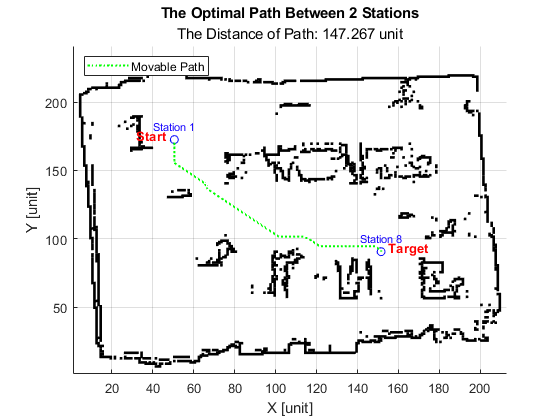

# 1. Overview
This simulation project demonstrates the operation of algorithms to solve Travelling Salesman Problem (TSP), Indoor Travelling Salesman Problem (ITSP) for single or multiple mobile robot system (MMRS), Multiple Travelling Salesman Problem (MTSP) and Indoor Multiple Travelling Salesman Problem (IMTSP) for MMRS. All problems TSP, ITSP, MTSP and IMTSP are solved by Ant Colony Optimization (ACO) algorithm. Where ITSP and IMTSP, pair of stations path is optimized by A* algorithm. In addition, this project also simulated optimal path for formation robots.

The part of this project was published in the 2023 International Conference on System Science and Engineering (ICSSE):

https://ieeexplore.ieee.org/abstract/document/10227075

Note: Shall use MATLAB Version 2021a or higher version.

# 2. How to run this project?

First, clone project by link or download and  .zip file. Open MATLAB and archieve workspace to downloaded folder.

## 2.1 Travelling Salesman Problem (TSP) simulation

In file `mainACO.m`, change this line into your path of 2D position file:

`file = fopen('E:\Programming\Swarm\Input\Input10.txt', 'r');`

File `Input10.txt` has 2 collumns corresponding `x` and `y`:
```
1  5
2  1
2  7
4  4
5  9
6  3
7  4
8  3
8  7
9  8
```

Run file and we will get result as bellow:


## 2.2 A* simulation
In file `mainAstar.m`, change this line into your path of map file:

`mymap = imread('./images/mymapC304.pgm');`

Run file and choose points you want. We will get result as bellow:


## 2.3 Indoor Travelling Salesman Problem (ITSP) simulation

In file `main.m`, change this line into your path of map file:

`mymap = imread('./images/mymapC304.pgm');`

Run file and choose points you want. We will get result as bellow:


## 2.4 ITSP combine with formation control

After computting optimal path of leader robot by ACO, based on Feedback Linearization Control to compute position for follower robots. In this example, three robots with triangle formation is used.

In file `main8.m`, change this line into your path of map file:

`mymap = imread('./images/mymapC304.pgm');`

Run file and choose points you want. We will get result as bellow:


Result looks like good, but to make visual result is better, I wrote the file `plotAfterRun.m`. Run this file after running file `main8.m`, results will be created automaticaly as bellow:




## 2.5 Multiple Travelling Salesman Problem (MTSP) simulation

In file `testmtsp.m`, change this line into your path of 2D position file:

`file = fopen('E:\Programming\Swarm\Input\Input10.txt', 'r');`

The structure of file is same in file `Input10.txt` above. Run file and we will get result as bellow:


In order to apply this algorithm in other platform (ROS,...), I converted this program into python code for easy to use. Source of python code is in folder `mtsp_python`.

## 2.6 Indoor Multiple Travelling Salesman Problem (IMTSP)

In file `mTSPandFormation.m`, change this line into your path of map file:

`mymap = imread('./images/mymapC304.pgm');`

Run file and choose points you want. We will get result as bellow:


